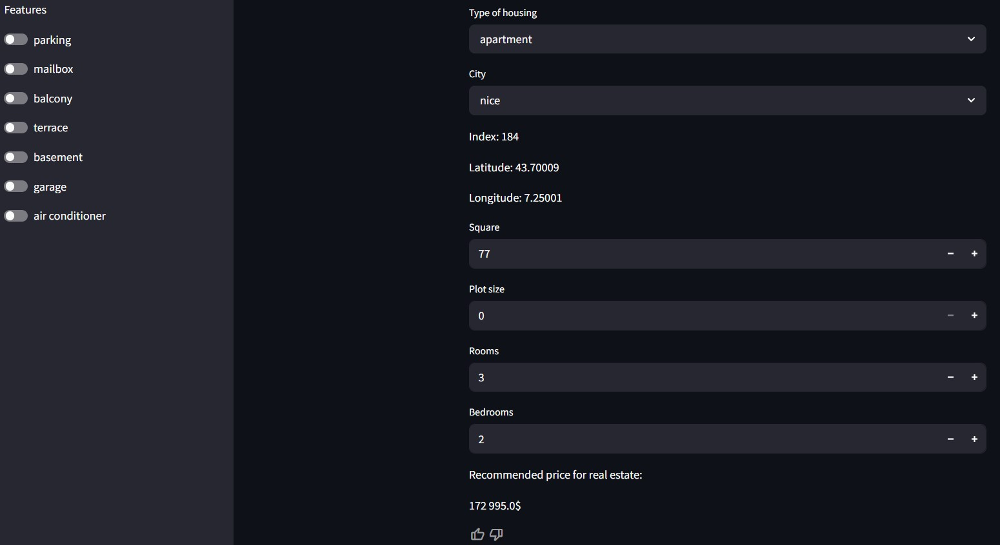
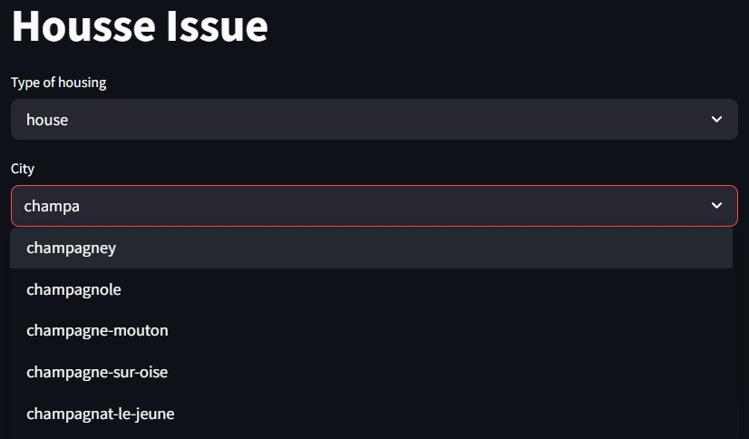
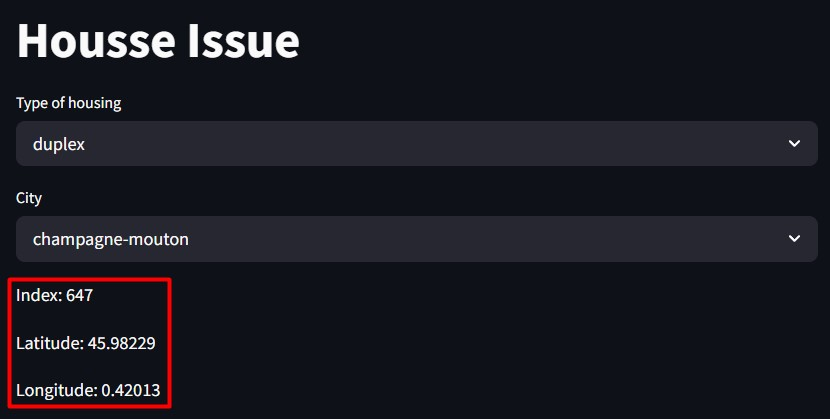
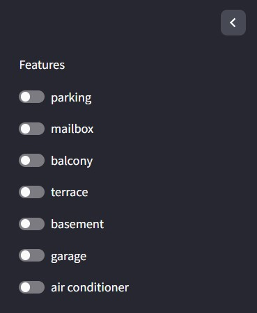

# House Issue (web version)

This repository presents the Implementation of a web interface based on the Stramlit library for solving the "Housing Issue" problem of the artificial intelligence track of the RuCode 2024 festival.

With this utility you can get the recommended price for selling real estate in France

## Full window
Inside the interface there are search fields, numerical data entry fields, a sidebar with switches for binary features and a prediction output at the very bottom of the window

## Search
The program has search fields with hints for the type of housing and city.

### Geo
After selecting a city, the geographic information about the property is updated.

## Sidebar
The sidebar contains switches for selecting additional real estate features.

## Result
The result of the program is a prediction of the cost of real estate.

The cost value is updated automatically with any change inparameters. After receiving the result, you can click on theinteractive buttons to evaluate the program's work.
